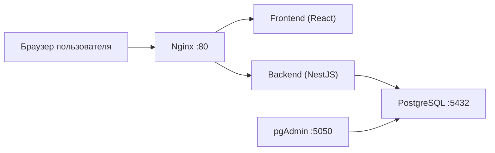
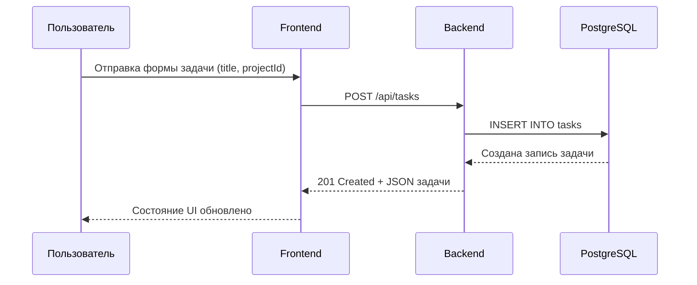

# Архитектура

## Назначение
Приложение для управления задачами и проектами:
- frontend: React + Redux Toolkit
- backend: NestJS + TypeORM
- база данных: PostgreSQL
- reverse proxy: Nginx

## Контейнерная схема

## Поток запроса (создание задачи)

## Ответственность модулей
- `frontend`: интерфейс, управление состоянием, вызовы API.
- `backend/src/modules/projects`: CRUD проектов, защита от удаления системных проектов.
- `backend/src/modules/tasks`: CRUD задач и переключение статуса.
- `backend/src/database/migrations`: миграции схемы и данных.
- `backend/src/database/seeds`: тестовые/стартовые данные для dev.

## Ключевые архитектурные правила
- Изменения схемы БД проходят через миграции (`migration:run`), а не через ручной SQL.
- По умолчанию используется `DB_SYNCHRONIZE=false`.
- Системные проекты защищены на уровне бизнес-логики.
