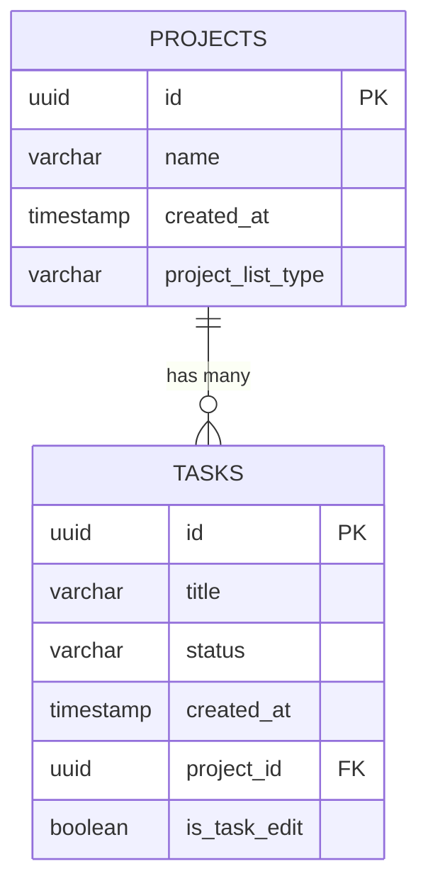

# Модель данных

## ER-диаграмма

## Сущности

### `projects`
- `id` UUID PK
- `name` VARCHAR(255) NOT NULL
- `created_at` TIMESTAMP DEFAULT `CURRENT_TIMESTAMP`
- `project_list_type` VARCHAR(50) DEFAULT `custom`

### `tasks`
- `id` UUID PK
- `title` VARCHAR(255) NOT NULL
- `status` VARCHAR(50) DEFAULT `new`
- `created_at` TIMESTAMP DEFAULT `CURRENT_TIMESTAMP`
- `project_id` UUID NOT NULL
- `is_task_edit` BOOLEAN DEFAULT `false`

## Ограничения и связи
- FK: `tasks.project_id -> projects.id`
- Поведение FK при удалении: `ON DELETE CASCADE`
- Индекс: `idx_tasks_project_id` для `tasks(project_id)`

## Системные проекты
- Источник реестра: `backend/src/modules/projects/constants/system-projects.registry.ts`
- Текущий системный проект:
  - `d406e045-29e0-4ae3-a8b9-aed2622cb328` / `inbox`
- Бизнес-правило:
  - `project_list_type = system` нельзя удалять.
